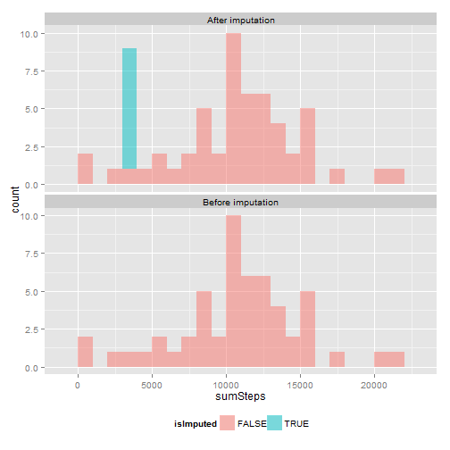

Peer Assessment 1
=================

Peer assessment 1 assignment for Coursera course [Reproducible Research](Reproducible Research).

> ## Introduction
> 
> It is now possible to collect a large amount of data about personal
> movement using activity monitoring devices such as a
> [Fitbit](http://www.fitbit.com), [Nike
> Fuelband](http://www.nike.com/us/en_us/c/nikeplus-fuelband), or
> [Jawbone Up](https://jawbone.com/up). These type of devices are part of
> the "quantified self" movement -- a group of enthusiasts who take
> measurements about themselves regularly to improve their health, to
> find patterns in their behavior, or because they are tech geeks. But
> these data remain under-utilized both because the raw data are hard to
> obtain and there is a lack of statistical methods and software for
> processing and interpreting the data.
> 
> This assignment makes use of data from a personal activity monitoring
> device. This device collects data at 5 minute intervals through out the
> day. The data consists of two months of data from an anonymous
> individual collected during the months of October and November, 2012
> and include the number of steps taken in 5 minute intervals each day.
> 
> ## Data
> 
> The data for this assignment can be downloaded from the course web
> site:
> 
> * Dataset: [Activity monitoring data](https://d396qusza40orc.cloudfront.net/repdata%2Fdata%2Factivity.zip) [52K]
> 
> The variables included in this dataset are:
> 
> * **steps**: Number of steps taking in a 5-minute interval (missing
>     values are coded as `NA`)
> 
> * **date**: The date on which the measurement was taken in YYYY-MM-DD
>     format
> 
> * **interval**: Identifier for the 5-minute interval in which
>     measurement was taken
> 
> 
> 
> 
> The dataset is stored in a comma-separated-value (CSV) file and there
> are a total of 17,568 observations in this
> dataset.
> 
> 
> ## Assignment
> 
> This assignment will be described in multiple parts. You will need to
> write a report that answers the questions detailed below. Ultimately,
> you will need to complete the entire assignment in a **single R
> markdown** document that can be processed by **knitr** and be
> transformed into an HTML file.
> 
> Throughout your report make sure you always include the code that you
> used to generate the output you present. When writing code chunks in
> the R markdown document, always use `echo = TRUE` so that someone else
> will be able to read the code. **This assignment will be evaluated via
> peer assessment so it is essential that your peer evaluators be able
> to review the code for your analysis**.
> 
> For the plotting aspects of this assignment, feel free to use any
> plotting system in R (i.e., base, lattice, ggplot2)
> 
> Fork/clone the [GitHub repository created for this
> assignment](http://github.com/rdpeng/RepData_PeerAssessment1). You
> will submit this assignment by pushing your completed files into your
> forked repository on GitHub. The assignment submission will consist of
> the URL to your GitHub repository and the SHA-1 commit ID for your
> repository state.
> 
> NOTE: The GitHub repository also contains the dataset for the
> assignment so you do not have to download the data separately.
> 
> 
> 

Load packages.


```r
packages <- c("data.table", "ggplot2", "xtable")
sapply(packages, require, character.only = TRUE, quietly = TRUE)
```

```
## data.table    ggplot2     xtable 
##       TRUE       TRUE       TRUE
```


> ### Loading and preprocessing the data
> 
> Show any code that is needed to
> 
> 1. Load the data (i.e. `read.csv()`)
> 
> 2. Process/transform the data (if necessary) into a format suitable for your analysis

Unzip the data file.


```r
executable <- file.path("C:", "Program Files (x86)", "7-Zip", "7z.exe")
parameters <- "x"
f <- file.path(getwd(), "activity.zip")
switch <- "-aoa"
cmd <- paste(paste0("\"", executable, "\""), parameters, paste0("\"", f, "\""), 
    switch)
cmd
```

```
## [1] "\"C:/Program Files (x86)/7-Zip/7z.exe\" x \"C:/Users/Ben/Documents/GitHub repositories/RepData_PeerAssessment1/activity.zip\" -aoa"
```

```r
system(cmd)
```


Read the CSV file.
Convert the data frame to a data table using the [`data.table`](http://cran.r-project.org/web/packages/data.table/index.html) package.


```r
dt <- read.csv(file.path(getwd(), "activity.csv"))
dt <- data.table(dt)
setkey(dt, date, interval)
```

 
Verify that the number of rows in the dataset is the expected value of 17,568.


```r
message(sprintf("Is the number of rows in the dataset 17,568? %s", nrow(dt) == 
    17568))
```

```
## Is the number of rows in the dataset 17,568? TRUE
```


Convert the `date` variable to a date class.
And look at the structure of the dataset.


```r
dt <- dt[, `:=`(date, as.Date(date))]
str(dt)
```

```
## Classes 'data.table' and 'data.frame':	17568 obs. of  3 variables:
##  $ steps   : int  NA NA NA NA NA NA NA NA NA NA ...
##  $ date    : Date, format: "2012-10-01" "2012-10-01" ...
##  $ interval: int  0 5 10 15 20 25 30 35 40 45 ...
##  - attr(*, ".internal.selfref")=<externalptr>
```


> ### What is mean total number of steps taken per day?
> 
> For this part of the assignment, you can ignore the missing values in
> the dataset.
> 
> 1. Make a histogram of the total number of steps taken each day
> 
> 2. Calculate and report the **mean** and **median** total number of steps taken per day

Aggregate the number of steps taken each day.
Ignore the missing values.


```r
dtDaily <- dt[, list(sumSteps = sum(steps, na.rm = TRUE)), date]
```


Plot a histogram of the total number of steps taken each day.


```r
ggplot(dtDaily, aes(x = date, y = sumSteps)) + geom_histogram(stat = "identity")
```

 


Calculate the mean and median total number of steps taken per day.


```r
print(xtable(dtDaily[, list(mean = mean(sumSteps), median = median(sumSteps))]), 
    type = "html", include.rownames = FALSE)
```

<!-- html table generated in R 3.0.2 by xtable 1.7-1 package -->
<!-- Sun May 11 07:29:20 2014 -->
<TABLE border=1>
<TR> <TH> mean </TH> <TH> median </TH>  </TR>
  <TR> <TD align="right"> 9354.23 </TD> <TD align="right"> 10395 </TD> </TR>
   </TABLE>


> ### What is the average daily activity pattern?
> 
> 1. Make a time series plot (i.e. `type = "l"`) of the 5-minute interval (x-axis) and the average number of steps taken, averaged across all days (y-axis)
> 
> 2. Which 5-minute interval, on average across all the days in the dataset, contains the maximum number of steps?

Aggregate the average number of steps taken by 5-minute interval.


```r
dtIntervals <- dt[, list(meanSteps = mean(steps, na.rm = TRUE)), interval]
```


Plot a time series of the 5-minute interval and the average number of steps taken across all days.


```r
ggplot(dtIntervals, aes(x = interval, y = meanSteps)) + geom_line()
```

 


> ### Imputing missing values
> 
> Note that there are a number of days/intervals where there are missing
> values (coded as `NA`). The presence of missing days may introduce
> bias into some calculations or summaries of the data.
> 
> 1. Calculate and report the total number of missing values in the dataset (i.e. the total number of rows with `NA`s)
> 
> 2. Devise a strategy for filling in all of the missing values in the dataset. The strategy does not need to be sophisticated. For example, you could use the mean/median for that day, or the mean for that 5-minute interval, etc.
> 
> 3. Create a new dataset that is equal to the original dataset but with the missing data filled in.
> 
> 4. Make a histogram of the total number of steps taken each day and Calculate and report the **mean** and **median** total number of steps taken per day. Do these values differ from the estimates from the first part of the assignment? What is the impact of imputing missing data on the estimates of the total daily number of steps?

Calculate the total number of missing values.


```r
dt <- dt[, `:=`(isStepsMissing, is.na(steps))]
print(xtable(dt[, .N, isStepsMissing]), type = "html", include.rownames = FALSE)
```

<!-- html table generated in R 3.0.2 by xtable 1.7-1 package -->
<!-- Sun May 11 07:29:20 2014 -->
<TABLE border=1>
<TR> <TH> isStepsMissing </TH> <TH> N </TH>  </TR>
  <TR> <TD> TRUE </TD> <TD align="right"> 2304 </TD> </TR>
  <TR> <TD> FALSE </TD> <TD align="right"> 15264 </TD> </TR>
   </TABLE>


Fit a linear model for the number of steps taken using the 5-minute interval as the predictor.
Specify the 5-minute interval predictor as a factor class variable.
This model estimates the mean number of steps taken for each 5-minute interval.
Use the predicted values from this model to impute missing values; call this variable `stepsImputed`.


```r
M <- lm(steps ~ factor(interval), data = dt, na.action = "na.exclude")
dt <- dt[, `:=`(stepsImputed, steps)]
dt$stepsImputed[dt$isStepsMissing] <- predict(M, newdata = dt)[dt$isStepsMissing]
```


Verify that there are no missing values for `stepsImputed`.


```r
print(xtable(dt[, .N, list(isMissing = is.na(stepsImputed))]), type = "html", 
    include.rownames = FALSE)
```

<!-- html table generated in R 3.0.2 by xtable 1.7-1 package -->
<!-- Sun May 11 07:29:23 2014 -->
<TABLE border=1>
<TR> <TH> isMissing </TH> <TH> N </TH>  </TR>
  <TR> <TD> FALSE </TD> <TD align="right"> 17568 </TD> </TR>
   </TABLE>


Verify that missingness is complete for an entire day.
Show all days with at least 1 missing value for the `steps` variable.
Calculate the proportion of records with missing values for each such day.
All proportions are 100%.


```r
dtMissingness <- dt[, list(countMissing = sum(isStepsMissing), countRecords = .N, 
    propMissing = sum(isStepsMissing/.N)), date]
dtMissingness[countMissing > 0]
```

```
##          date countMissing countRecords propMissing
## 1: 2012-10-01          288          288           1
## 2: 2012-10-08          288          288           1
## 3: 2012-11-01          288          288           1
## 4: 2012-11-04          288          288           1
## 5: 2012-11-09          288          288           1
## 6: 2012-11-10          288          288           1
## 7: 2012-11-14          288          288           1
## 8: 2012-11-30          288          288           1
```


#### After imputation of missing values

Aggregate the number of steps taken each day.


```r
dtDaily <- dt[, list(sumSteps = sum(steps, na.rm = TRUE), sumStepsImputed = sum(stepsImputed), 
    isImputed = sum(isStepsMissing) > 0), date]
dtDaily
```

```
##           date sumSteps sumStepsImputed isImputed
##  1: 2012-10-01        0           10766      TRUE
##  2: 2012-10-02      126             126     FALSE
##  3: 2012-10-03    11352           11352     FALSE
##  4: 2012-10-04    12116           12116     FALSE
##  5: 2012-10-05    13294           13294     FALSE
##  6: 2012-10-06    15420           15420     FALSE
##  7: 2012-10-07    11015           11015     FALSE
##  8: 2012-10-08        0           10766      TRUE
##  9: 2012-10-09    12811           12811     FALSE
## 10: 2012-10-10     9900            9900     FALSE
## 11: 2012-10-11    10304           10304     FALSE
## 12: 2012-10-12    17382           17382     FALSE
## 13: 2012-10-13    12426           12426     FALSE
## 14: 2012-10-14    15098           15098     FALSE
## 15: 2012-10-15    10139           10139     FALSE
## 16: 2012-10-16    15084           15084     FALSE
## 17: 2012-10-17    13452           13452     FALSE
## 18: 2012-10-18    10056           10056     FALSE
## 19: 2012-10-19    11829           11829     FALSE
## 20: 2012-10-20    10395           10395     FALSE
## 21: 2012-10-21     8821            8821     FALSE
## 22: 2012-10-22    13460           13460     FALSE
## 23: 2012-10-23     8918            8918     FALSE
## 24: 2012-10-24     8355            8355     FALSE
## 25: 2012-10-25     2492            2492     FALSE
## 26: 2012-10-26     6778            6778     FALSE
## 27: 2012-10-27    10119           10119     FALSE
## 28: 2012-10-28    11458           11458     FALSE
## 29: 2012-10-29     5018            5018     FALSE
## 30: 2012-10-30     9819            9819     FALSE
## 31: 2012-10-31    15414           15414     FALSE
## 32: 2012-11-01        0           10766      TRUE
## 33: 2012-11-02    10600           10600     FALSE
## 34: 2012-11-03    10571           10571     FALSE
## 35: 2012-11-04        0           10766      TRUE
## 36: 2012-11-05    10439           10439     FALSE
## 37: 2012-11-06     8334            8334     FALSE
## 38: 2012-11-07    12883           12883     FALSE
## 39: 2012-11-08     3219            3219     FALSE
## 40: 2012-11-09        0           10766      TRUE
## 41: 2012-11-10        0           10766      TRUE
## 42: 2012-11-11    12608           12608     FALSE
## 43: 2012-11-12    10765           10765     FALSE
## 44: 2012-11-13     7336            7336     FALSE
## 45: 2012-11-14        0           10766      TRUE
## 46: 2012-11-15       41              41     FALSE
## 47: 2012-11-16     5441            5441     FALSE
## 48: 2012-11-17    14339           14339     FALSE
## 49: 2012-11-18    15110           15110     FALSE
## 50: 2012-11-19     8841            8841     FALSE
## 51: 2012-11-20     4472            4472     FALSE
## 52: 2012-11-21    12787           12787     FALSE
## 53: 2012-11-22    20427           20427     FALSE
## 54: 2012-11-23    21194           21194     FALSE
## 55: 2012-11-24    14478           14478     FALSE
## 56: 2012-11-25    11834           11834     FALSE
## 57: 2012-11-26    11162           11162     FALSE
## 58: 2012-11-27    13646           13646     FALSE
## 59: 2012-11-28    10183           10183     FALSE
## 60: 2012-11-29     7047            7047     FALSE
## 61: 2012-11-30        0           10766      TRUE
##           date sumSteps sumStepsImputed isImputed
```


Plot a histogram of the total number of steps taken each day. Indicate dates with imputed values using a different color.


```r
ggplot(dtDaily, aes(x = date, y = sumStepsImputed, fill = isImputed)) + geom_histogram(stat = "identity", 
    alpha = 1/2) + theme(legend.position = "bottom")
```

 


Calculate the mean and median total number of steps taken per day.


```r
print(xtable(dtDaily[, list(meanBefore = mean(sumSteps), meanImputed = mean(sumStepsImputed), 
    medianBefore = median(sumSteps), medianImputed = median(sumStepsImputed))]), 
    type = "html", include.rownames = FALSE)
```

<!-- html table generated in R 3.0.2 by xtable 1.7-1 package -->
<!-- Sun May 11 07:29:23 2014 -->
<TABLE border=1>
<TR> <TH> meanBefore </TH> <TH> meanImputed </TH> <TH> medianBefore </TH> <TH> medianImputed </TH>  </TR>
  <TR> <TD align="right"> 9354.23 </TD> <TD align="right"> 10766.19 </TD> <TD align="right"> 10395 </TD> <TD align="right"> 10766.19 </TD> </TR>
   </TABLE>


The median of the imputed values isn't so different from the original values where missing values were not imputed.
However, the mean of the imputed values is a bit higher from the original values.
The overall impact of the imputed values is to raise the estimates of the number of steps taken each day.
Before imputation, the number of steps taken was essentially zero.


> ### Are there differences in activity patterns between weekdays and weekends?
> 
> For this part the `weekdays()` function may be of some help here. Use
> the dataset with the filled-in missing values for this part.
> 
> 1. Create a new factor variable in the dataset with two levels -- "weekday" and "weekend" indicating whether a given date is a weekday or weekend day.
> 
> 1. Make a panel plot containing a time series plot (i.e. `type = "l"`) of the 5-minute interval (x-axis) and the average number of steps taken, averaged across all weekday days or weekend days (y-axis). The plot should look something like the following, which was creating using **simulated data**:
> 
>  
> 
> **Your plot will look different from the one above** because you will
> be using the activity monitor data. Note that the above plot was made
> using the lattice system but you can make the same version of the plot
> using any plotting system you choose.

Create a new factor variable in the dataset with two levels -- "weekday" and "weekend" indicating whether a given date is a weekday or weekend day.
Use this solution to [collapse the factor values](http://stackoverflow.com/a/9053619) for day of week.
Verify that `dayOfWeek` and `dayType` are factor class variables.


```r
levels <- c("Sunday", "Monday", "Tuesday", "Wednesday", "Thursday", "Friday", 
    "Saturday")
newLevels <- c("Weekend", rep("Weekday", 5), "Weekend")
dt <- dt[, `:=`(dayOfWeek, factor(weekdays(date), levels = levels))]
dt <- dt[, `:=`(dayType, factor(newLevels[dayOfWeek]))]
dt[, .N, list(dayType, dayOfWeek)]
```

```
##    dayType dayOfWeek    N
## 1: Weekday    Monday 2592
## 2: Weekday   Tuesday 2592
## 3: Weekday Wednesday 2592
## 4: Weekday  Thursday 2592
## 5: Weekday    Friday 2592
## 6: Weekend  Saturday 2304
## 7: Weekend    Sunday 2304
```

```r
message(sprintf("Is dayOfWeek a factor? %s. Is dayType a factor? %s", is.factor(dt$dayOfWeek), 
    is.factor(dt$dayType)))
```

```
## Is dayOfWeek a factor? TRUE. Is dayType a factor? TRUE
```


Aggregate the average number of steps taken by 5-minute interval.
Use the imputed values in the `stepsImputed` variable.


```r
dtIntervals <- dt[, list(meanSteps = mean(stepsImputed, na.rm = TRUE)), list(dayType, 
    interval)]
```


Plot two time series (one for weekdays and the other for weekends) of the 5-minute intervals and average number of steps taken (imputed values).


```r
ggplot(dtIntervals, aes(x = interval, y = meanSteps, color = dayType)) + geom_line() + 
    facet_wrap(~dayType, nrow = 2) + theme(legend.position = "none")
```

 


It's a bit hard to discern any differences.
So overlay the time series on a single plot instead of using a panel plot.


```r
ggplot(dtIntervals, aes(x = interval, y = meanSteps, color = dayType)) + geom_line() + 
    theme(legend.position = "bottom")
```

 

